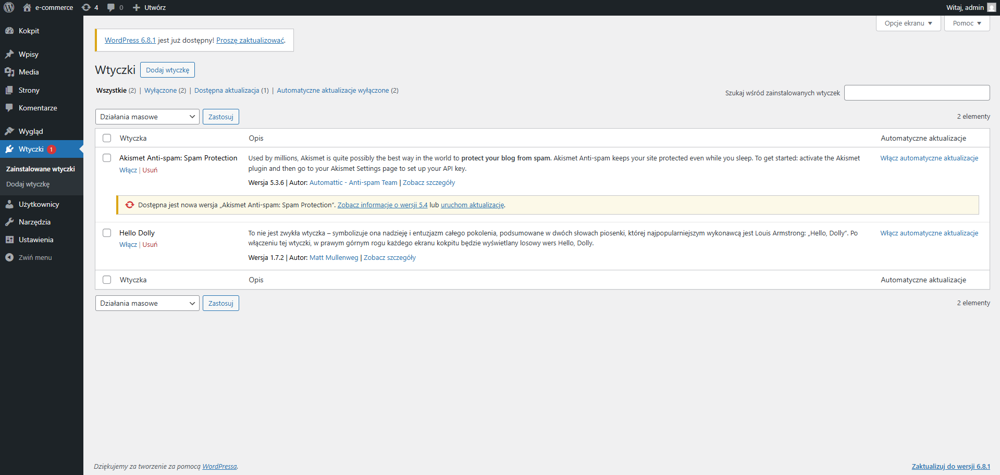

# WordPress vs Symfony – Porównanie

[](https://wordpress.org/) [](https://www.gnu.org/licenses/old-licenses/gpl-2.0.en.html)

---

## Spis treści

1. [Opis teoretyczny WordPress](#opis-teoretyczny-wordpress)  
2. [Podstawowe cechy WordPress](#podstawowe-cechy-wordpress)  
3. [Struktura WordPress](#struktura-wordpress)  
4. [Zastosowania WordPress](#zastosowania-wordpress)  
5. [Zalety i wady WordPress](#zalety-i-wady-wordpress)  
6. [Porównanie najpopularniejszych motywów](#porownanie-najpopularniejszych-motywow)  
7. [Porównanie obszarów: WordPress vs Symfony](#porownanie-obszarow-wordpress-vs-symfony)  
   - [Instalacja i konfiguracja](#instalacja-i-konfiguracja)  
   - [Schemat docker-compose.yml](#schemat-docker-composeyml)  
   - [Czas wdrożenia](#czas-wdrozenia)  

---

## Opis teoretyczny WordPress

WordPress narodził się w 2003 roku jako prosty silnik blogowy, jednak już wkrótce wykrystalizował się w potężny i elastyczny system zarządzania treścią (CMS). Jego filozofia opiera się na zasadzie „demokratyzacji publikacji” – każdy, niezależnie od poziomu zaawansowania technicznego, powinien móc stworzyć i prowadzić własną stronę internetową. Lekki instalator, intuicyjny interfejs oraz przejrzysta organizacja plików sprawiają, że proces uruchomienia witryny jest szybki i nieskomplikowany.

Rdzeń WordPressa opiera się na języku PHP i relacyjnej bazie danych MySQL lub MariaDB. Architektura ta umożliwia dynamiczne generowanie stron oraz łatwe skalowanie od niewielkich blogów po rozbudowane portale korporacyjne. Kluczowym mechanizmem wewnętrznym są tzw. hooki — punkty zaczepienia (actions i filters), które pozwalają wtyczkom i motywom zmieniać lub rozszerzać funkcjonalność systemu bez ingerencji w pliki core. Dzięki temu całość pozostaje elastyczna i odporna na modyfikacje podczas aktualizacji.

Model danych WordPressa oparty jest na pojęciu „postów”, które domyślnie reprezentują zarówno wpisy blogowe, jak i statyczne strony. Możliwość definiowania własnych typów treści (Custom Post Types) oraz taksonomii (Custom Taxonomies) pozwala tworzyć rozbudowane struktury informacji, dopasowane do specyfiki danego projektu. To podejście sprawia, że WordPress doskonale radzi sobie nie tylko z prostymi publikacjami, ale również z katalogami produktów, galeriami czy nawet systemami e-learningowymi.

Interfejs graficzny panelu administracyjnego został zaprojektowany z myślą o czytelności i ergonomii pracy. Dzięki systemowi motywów (Themes) można niemal dowolnie zmieniać wygląd strony, a zaawansowany edytor blokowy Gutenberg umożliwia budowanie rozbudowanych układów treści bez pisania ani jednej linijki kodu. Z kolei architektura wtyczek (Plugins) otwiera niemal nieograniczone możliwości – od prostych formularzy kontaktowych, przez zaawansowane narzędzia SEO, aż po kompletne rozwiązania e-commerce, jak WooCommerce.

W ostatnich latach WordPress rozwinął również własne REST API, co czyni go pełnoprawnym headless CMS-em. Zewnętrzne aplikacje i frameworki (React, Vue, mobilne) mogą korzystać z zasobów WordPressa jako backendu, zachowując pełną kontrolę nad warstwą prezentacji. Dzięki temu deweloperzy otrzymują nowoczesne narzędzie, które łączy niezawodność sprawdzonego silnika z elastycznością nowoczesnych technologii front-endowych.

Podsumowując, teoretyczny fundament WordPressa stanowi połączenie prostoty użytkowania, otwartej architektury oraz szerokiego ekosystemu społeczności. To sprawia, że system jest zarówno doskonałym wyborem dla osób rozpoczynających przygodę z tworzeniem stron, jak i dla zaawansowanych programistów potrzebujących solidnej bazy do realizacji niestandardowych projektów.

---

## Podstawowe cechy WordPress

1. **Open Source**  
   Darmowy, ciągle rozwijany przez społeczność.

2. **Łatwość użycia**  
   Intuicyjny panel administracyjny.

3. **Rozbudowa i personalizacja**  
   Tysiące wtyczek i motywów.

4. **Skalowalność**  
   Od blogów po duże sklepy e-commerce.

5. **SEO**  
   Wbudowane mechanizmy i wtyczki (Yoast, All in One SEO).

6. **Wsparcie społeczności**  
   Fora, grupy, dokumentacja.

7. **Bezpieczeństwo**  
   Regularne aktualizacje i wtyczki zabezpieczające.

---

## Struktura WordPress

- **Baza danych (MySQL/MariaDB)**  
  Przechowuje treści, użytkowników, ustawienia.
- **Pliki motywów**  
  HTML/PHP, CSS, JS definiujące wygląd.
- **Wtyczki**  
  Rozszerzają funkcjonalność.
- **Panel administratora**  
  UI do zarządzania treścią i konfiguracją.

---

## Zastosowania WordPress

- **Blogi**  
- **Strony firmowe**  
- **Sklepy internetowe (WooCommerce)**  
- **Portfolia**  
- **Platformy e-learningowe**  
- **Fora internetowe (bbPress)**  

---

## Zalety i wady WordPress

| Zalety                          | Wady                                    |
|---------------------------------|-----------------------------------------|
| Łatwość w obsłudze              | Ataki, jeśli brak aktualizacji          |
| Elastyczność i personalizacja   | Możliwe spowolnienie przy wielu wtyczkach |
| Ogromna społeczność i zasoby    | Czasem potrzeba wiedzy technicznej      |
| Regularne aktualizacje          |                                         |

---

## Porównanie najpopularniejszych motywów

| Motyw             | Cena roczna (PLN) | FSE   | Customizer | Demo import     | Typografia               | WooCommerce-ready | Header/Footer Builder | Mega Menu | Global Styles | RTL Support | Performance       |
|-------------------|-------------------|-------|------------|-----------------|--------------------------|-------------------|-----------------------|-----------|---------------|-------------|-------------------|
| **Astra**         | ~250 PLN          | ❌    | ✅         | >100 szablonów  | Rozbudowane ustawienia   | ✅                | ✅                    | ✅        | ✅            | ✅          | Bardzo lekki      |
| **GeneratePress** | ~250 PLN          | ❌    | ✅         | ~60 szablonów   | Elastyczne, podstawowe   | ✅                | ❌ (hooki)            | ❌        | ❌            | ✅          | Ekstremalnie lekki|
| **OceanWP**       | ~165 PLN          | ❌    | ✅         | >50 szablonów   | Dobre                    | ✅                | ✅                    | ✅        | Ograniczone   | ✅          | Średnio lekki     |
| **Blocksy**       | ~210 PLN          | ✅    | ✅         | >40 szablonów   | Pełna kontrola           | ✅ (Pro)          | ✅                    | ✅        | ✅            | ✅          | Lekki             |

---

## Porównanie obszarów: WordPress vs Symfony

| Obszar                              | WordPress                                                    | Symfony                                                      |
|-------------------------------------|--------------------------------------------------------------|--------------------------------------------------------------|
| **Instalacja i konfiguracja**       | Docker+docker-compose, PHP & MariaDB                         | Composer, wymaga PHP 7.4+, skonfigurowanie bundle’ów         |
| **Baza danych**                     | WP_Query, tabela `wp_*`                                      | Doctrine ORM, encje, repository                              |
| **Zarządzanie produktami**          | WooCommerce: proste UI, warianty, kategorie                  | Ręczna implementacja, CRUD, bardziej kodu                    |
| **Zarządzanie użytkownikami**       | Wbudowane role, pluginy rozszerzające                        | Security Bundle, Role Hierarchy, voters                      |
| **Koszyk i zamówienia**             | WooCommerce: automatyczne, API                               | Custom API, kontrolery, więcej kodu                          |
| **Panel administratora**            | Gotowy WP-Admin, liczne wtyczki                              | EasyAdminBundle lub SonataAdmin, konfiguracja YAML/PHP       |
| **Wydajność**                       | Caching pluginy (WP Super Cache, W3 Total Cache)             | HTTP Cache, OPcache, Varnish                                 |
| **Rozszerzalność**                  | Wtyczki, hooki, filtry                                       | Bundles, EventDispatcher, Dependency Injection               |
| **Szablony i wygląd**               | PHP Template, Gutenberg Blocks                               | Twig, komponenty, Assetic                                    |
| **Bezpieczeństwo**                  | Core + pluginy zabezpieczające                               | Security Bundle, własne policy, HTTPS                        |
| **Cena i czas developmentu**        | Szybkie MVP dzięki gotowym rozwiązaniom                      | Dłuższy czas (kilka tygodni), wyższe koszty                  |
| **Testowanie**                      | PHPUnit, pluginy                                             | PHPUnit, Behat, PHPSpec                                      |
| **Społeczność i dokumentacja**      | Ogromna, fora, Codex                                         | Oficjalna docs, SensioLabs, mniejsze community               |

---

### Instalacja i konfiguracja

#### 1) Symfony

#### 2) Wordpress
  a) wymagania wstępne:
  - serwer WWW (np. Apache, Nginx, Docker),
  - baza danych (np. MySQL, MariaDB),
  - (opcjonalnie domena (na początku może być localhost).

> [!NOTE]
> W celu wykonania analizy porównawczej obu frameworków baza danych została stworzona na serwerze online. Dzięki czemu oba projekty zasilane są tymi samymi danymi. Na nasze potrzeby wybrano bazę MariaDB. Wordpress postawiony został na Dockerze przy użyciu pliku docker-compose.yml oraz podstawowych komend dockera.

  b) przygotowanie pliku docker-compose.yml
  ```yaml
version: '3.7'

services:
  wordpress:
    image: wordpress:latest
    container_name: wp
    restart: always
    ports:
      - "8080:80"
    volumes:
      - wp_data:/var/www/html
    environment:
      WORDPRESS_DB_HOST: <DB_HOST>
      WORDPRESS_DB_NAME: <DB_NAME>
      WORDPRESS_DB_USER: <DB_USER>
      WORDPRESS_DB_PASSWORD: <DB_PASSWORD>

  phpmyadmin:
    image: phpmyadmin/phpmyadmin:4.7
    container_name: wp-phpmyadmin
    restart: always
    ports:
      - "12000:80"
    environment:
      PMA_HOST: <DB_PMA_HOST>
      PMA_USER: <DB_PMA_USER>
      PMA_PASSWORD: <DB_PMA_PASSWORD>

volumes:
  wp_data:
  wp_backups:
  pma_backups:
```

  c) utworzenie i uruchomienie kontenerów
  
```
docker-compose up -d
```

  d) konfiguracja
  Po uruchomieniu środowiska, instalacja WordPressa została przeprowadzona przez przeglądarkę:
-	Wejście pod adres: http://localhost:8080
-	Wypełnienie formularza instalacji:
  	- Tytuł witryny — np. "wp-ecommerce"
    - Nazwa użytkownika — administrator WordPressa
    - Hasło — silne hasło do panelu
    - Adres e-mail — do odzyskiwania konta
-	Po instalacji utworzono pierwszego użytkownika i zalogowano się do panelu administracyjnego `/wp-admin`.

  e) czas wdrożenia:
  Na wykonanie wszystkich wymaganych kroków potrzebnych do uruchomienia strony startowej w wordpress potrzebne było około **15 minut**.

---
## Podłączenie i komunikacja z bazą danych

Podłączenie do bazy danych w projekcie Wordpress można zrealizować na kilka sposobów.

- Pierwszy sposób polega na utworzeniu projektu wordpressa i modyfikacji wygenerowanego pliku `wp-config.php`. 

> [!NOTE]
> Plik wp-config.php to pierwszy załadowany przez WordPressa plik konfiguracyjny, który definiuje wszystkie kluczowe ustawienia witryny. Zawiera dane dostępu do bazy danych (nazwa, użytkownik, hasło, host) oraz prefiks tabel, dzięki czemu WordPress wie, gdzie i jak przechowywać swoje tabele. W tym samym miejscu umieszczone są tzw. klucze tajne (authentication keys i salts), które zabezpieczają pliki cookie i sesje użytkowników, a także opcje debugowania (WP_DEBUG i WP_DEBUG_LOG), pozwalające na rejestrowanie błędów w czasie tworzenia i testowania witryny. Dzięki centralizacji tych ustawień w jednym pliku możliwe jest szybkie uruchomienie, modyfikacja i zabezpieczenie środowiska WordPressa.
   
   W pliku tym dane podłączenia do bazy można ustawić na dwa sposoby:
   - poprzez zdefiniowanie w kodzie stałych takich jak `DB_NAME`, `DB_USER`, `DB_PASSWORD`, `DB_HOST`
   - pobieranie zmiennych środowiskowych z `$_ENV` lub `getenv()`
   
   ```php
   define('DB_NAME',     'nazwa_bazy');
   define('DB_USER',     'użytkownik');
   define('DB_PASSWORD', 'hasło');
   define('DB_HOST',     'localhost:3306');
   ```

- Drugi sposób polaga na utworzeniu połączenia z bazą danych poprzez odpowiednią konfigurację w pliku `docker-compose.yml` (zakładając że projekt wordpressa tworzony jest na Dockerze). Działa to na bardzo podobnej zasadzie co ustawianie zmiennych środowiskowych. Do kodu tworzenia kontenera należy dopisać poniższy fragment kodu:

   ```yml
   ...
   wordpress:
   ...
   environment:
     WORDPRESS_DB_HOST: db.example.com:3306
     WORDPRESS_DB_NAME: mydb
     WORDPRESS_DB_USER: user
     WORDPRESS_DB_PASSWORD: pass
   ...
   phpmyadmin:
   ...
   environment:
      PMA_HOST: <DB_PMA_HOST>
      PMA_USER: <DB_PMA_USER>
      PMA_PASSWORD: <DB_PMA_PASSWORD>
   ```

> [!NOTE]
> Zdefiniowanie w pliku `docker-compose.yml` zmiennych `PMA_HOST`, `PMA_USER` i `PMA_PASSWORD`pozwala by kontener phpMyAdmin automatycznie nawiązywał połączenie z bazą danych MariaDB, bez konieczności ręcznego logowania się w interfejsie po starcie. Tak przygotowana usługa dostarcza w przeglądarce całe środowisko do zarządzania bazą danych – od przeglądania i edycji rekordów, przez wykonywanie zapytań SQL, aż po import i eksport danych, optymalizację tabel czy zarządzanie uprawnieniami użytkowników.

- Trzecim sposobem na podłączenie do bazy danych jest użycie wtyczki do zewnętrznych źródeł danych. Istnieją wtyczki-most, które pozwalają łączyć się z innymi systemami (np. LDAP, zewnętrzne API, inne CMS'y), mapując tabele lub uwierzytelnianianie na wordpress.

> [!TIP]
> W przypadku podłączenia do bazy poprzez konfigurację z pliku `docket-compose.yml` poprawność połączenia można zweryfikwać poprzez zastosowanie kilku prostych komend w kosnoli.
```
docker exec -it wp bash
php -r "echo 'Host: '.getenv('WORDPRESS_DB_HOST').PHP_EOL;"
php -r "echo 'User: '.getenv('WORDPRESS_DB_USER').PHP_EOL;"
php -r "echo 'Pass: '.getenv('WORDPRESS_DB_PASSWORD').PHP_EOL;"
exit
```
Wyświetlenie poprawnych danych będzie oznaczać prawidłowe podłączenie do bazy.

---
## Zarządzanie produktami

---
## Zarządzanie użytkownikami

---
## Koszyk i zamówienia

---
## Panel administratora

### Kokpit  
  
Centralny pulpit nawigacyjny prezentuje kluczowe informacje i udostępnia szybki dostęp do najczęściej używanych funkcji:  
- **Stan witryny (Site Health)**  
  - Automatyczny monitoring wydajności, bezpieczeństwa oraz zgodności z zaleceniami WordPressa.  
  - Wykrywanie przestarzałych wtyczek, brakujących rozszerzeń PHP czy nieprawidłowych uprawnień plików.  
- **Powiadomienia i aktualizacje**  
  - Informowanie o dostępnych wersjach WordPressa, motywów i wtyczek.  
  - Jednoklikowa instalacja aktualizacji lub planowanie ich na dogodny moment.  
- **Widżety szybkiego dostępu**  
  - Tworzenie szkiców wpisów, stron lub zadań przy użyciu konfigurowalnych kafli.  
  - Podsumowanie aktywności użytkowników i komentarzy w czasie rzeczywistym.  
  - Możliwość dostosowania układu i widoczności widżetów w zależności od potrzeb administratora.

---

### Wpisy  
  
Kompleksowe zarządzanie treścią blogową i newsami:  
- **Blokowy edytor Gutenberg**  
  - Komponowanie układów stron z wykorzystaniem predefiniowanych bloków (tekst, obrazy, galerie, multimedia, shortcodes).  
  - Złożone konfiguracje kolumn, tła i stylów CSS bez konieczności pisania kodu.  
- **Kategoryzacja i tagowanie**  
  - Tworzenie hierarchii kategorii i oznaczanie wpisów tagami dla lepszej nawigacji i SEO.  
  - Bulk–akcje na wielu wpisach jednocześnie (zmiana statusu, przypisanie kategorii).  
- **Harmonogram publikacji**  
  - Planowanie automatycznej publikacji wpisów w określonym dniu i godzinie.  
  - Możliwość cofania terminu publikacji lub wcześniejszego udostępnienia treści.  
- **Rewizje i historia zmian**  
  - Śledzenie kolejnych wersji wpisu, porównywanie różnic i przywracanie wcześniejszych stanów.

---

### Media  
  
Zarządzanie wszystkimi zasobami graficznymi, wideo i dokumentami:  
- **Przesyłanie i organizacja**  
  - Import plików metodą drag-and-drop lub wybór z lokalnego dysku.  
  - Automatyczne generowanie miniaturek w kilku rozmiarach (thumbnail, medium, large).  
- **Edycja metadanych**  
  - Uzupełnianie tytułu, opisu, tekstu alternatywnego (alt) i podpisu, co wpływa na optymalizację SEO i dostępność.  
  - Modyfikacja parametrów obrazów (obrót, kadrowanie, skalowanie) wbudowanym edytorem.  
- **Filtrowanie i przeszukiwanie**  
  - Sortowanie zasobów według typu pliku, daty, nazwy lub rozmiaru.  
  - Grupowe zaznaczanie i usuwanie niepotrzebnych plików.

---

### Strony  
  
Obsługa statycznych podstron witryny:  
- **Hierarchia i atrybuty**  
  - Tworzenie stron nadrzędnych i podrzędnych, definiowanie szablonów (np. pełna szerokość, z sidebar’em).  
  - Ustalanie kolejności wyświetlania w menu poprzez ustawienie atrybutów „Kolejność”.  
- **Szablony i bloki globalne**  
  - Zastosowanie gotowych wzorców bloków lub zapis własnych bloków do ponownego wykorzystania.  
  - Integracja z page builderami, umożliwiająca tworzenie dedykowanych wzorców stron.  
- **Planowanie i dostęp**  
  - Harmonogram publikacji, ochrona strony hasłem lub ograniczenie widoczności dla zarejestrowanych użytkowników.

---

### Edycja strony (Page Builder)  
  
Zaawansowane narzędzie do tworzenia niestandardowych układów:  
- **Drag & Drop**  
  - Przeciąganie sekcji, kolumn i widżetów bezpośrednio na podgląd strony.  
- **Elastyczne siatki (Flexbox / Grid)**  
  - Konfiguracja kierunku, rozmieszczenia i proporcji elementów dla uzyskania responsywnego designu.  
- **Stylizacja i animacje**  
  - Definiowanie stylów tła, obramowań, cieni, marginesów i paddingów w intuicyjnym panelu.  
  - Możliwość dodawania animacji wejścia elementów (fade, slide itp.) oraz efektów hover.

---

### Komentarze  
Sekcja moderacji dyskusji nad treściami:  
- **Automatyczne filtrowanie**  
  - Wykrywanie spamu za pomocą reguł Akismet lub innych wtyczek antyspamowych.  
- **Panel moderacji**  
  - Szybkie akcje: zatwierdzenie, oznaczenie jako spam, przeniesienie do kosza.  
  - Masowe operacje na wielu komentarzach jednocześnie.

---

### Wygląd  
  
Dostosowanie wizualnej oprawy witryny:  
- **Instalacja motywów**  
  - Pobieranie i aktywacja motywów z oficjalnego repozytorium lub przesłanych archiwów.  
- **Customizer w czasie rzeczywistym**  
  - Podgląd zmian w układzie, kolorystyce, typografii, tle i nagłówkach przed zapisaniem.  
  - Konfiguracja menu nawigacyjnego, widgetów w sidebarze i stopce.  
- **Edytor plików motywu**  
  - Bezpośrednia edycja plików szablonu (PHP, CSS, JS) z uwzględnieniem funkcji override w motywach potomnych (child themes).

---

### Wtyczki  
  
Rozszerzanie funkcjonalności witryny:  
- **Instalacja i aktywacja**  
  - Wyszukiwanie, instalacja i konfiguracja wtyczek z oficjalnego repozytorium WP lub z lokalnych paczek.  
- **Zarządzanie aktualizacjami**  
  - Harmonogram automatycznych aktualizacji, przegląd dostępnych wersji i zabezpieczenie przed konfliktami.  
- **Konfiguracja**  
  - Bezpośrednie linki do stron ustawień każdej wtyczki, wsparcie dla multisite i ról użytkowników.

---

### Użytkownicy  
Sekcja zarządzania kontami i uprawnieniami:  
- **Role i uprawnienia**  
  - Przypisywanie ról (Administrator, Redaktor, Autor, Współpracownik, Subskrybent) z różnymi poziomami dostępu.  
- **Profil użytkownika**  
  - Edycja danych osobowych, ustawień biogramu, avataru i haseł.  
- **Import/eksport**  
  - Masowe dodawanie użytkowników przez pliki CSV lub integracja z systemami LDAP/SSO.

---

### Narzędzia  
Zestaw pomocniczych operacji administracyjnych:  
- **Import/Eksport treści**  
  - Eksport całej zawartości witryny lub wybranych elementów (wpisy, strony, komentarze) w formacie XML (WXR).  
  - Import danych z zewnętrznych systemów (WordPress, Blogger, CSV).  
- **Diagnostyka i konserwacja**  
  - Site Health: szczegółowe raporty o konfiguracji serwera, wydajności i bezpieczeństwie.  
  - Narzędzia deweloperskie: możliwość wykonania operacji naprawczych (reset permalinek, optymalizacja bazy danych).

---

### Ustawienia  

#### Ogólne  
  
Konfiguracja podstawowa witryny:  
- **Tożsamość witryny**  
  - Nazwa, slogan (tagline) i favicon (ikonka przeglądarki).  
- **Adresy URL**  
  - Adres instalacji WordPress (WordPress Address URL) i adres strony widocznego front-endu (Site Address URL).  
- **Użytkownicy**  
  - Domyślna rola nowych rejestrujących się użytkowników, włączenie/wyłączenie rejestracji.  
- **Lokalizacja**  
  - Język interfejsu, strefa czasowa, format daty i czasu.

#### Permalinki  
  
Zarządzanie strukturą adresów URL:  
- **Gotowe schematy**  
  - Prosty (identyfikator wpisu), Data + Nazwa, Miesiąc + Nazwa, Liczbowy, Nazwa wpisu.  
- **Własny format**  
  - Dowolne połączenie znaczników: `%year%`, `%monthnum%`, `%day%`, `%post_id%`, `%postname%`, `%category%`, `%author%`.  
- **SEO i użyteczność**  
  - Konstrukcja przyjaznych dla użytkownika i wyszukiwarek URL, eliminacja nieczytelnych parametrów.

---

Opisane możliwości panelu administracyjnego WordPress pozwalają na kompleksowe zarządzanie każdą stroną — od treści i mediów, przez wygląd i funkcje, aż po zaawansowane opcje wydajności i bezpieczeństwa.

---
## Wydajność

---
## Rozszerzalność

---
## Szablony i wygląd (UI/UX)

---
## Bezpieczeństwo

---
## Cena i czas developmentu

---
## Testowanie

---
## Społeczność i dokumentacja

Oficjalne źródła wiedzy obu platform stanowią punkt wyjścia dla programistów i administratorów, jednak różnią się pod względem struktury, przejrzystości i zakresu dostępnych rozwiązań.

WordPress udostępnia kompletną dokumentację na [wordpress.org/documentation](https://wordpress.org/documentation/), w której treści podzielono na sekcje: szybkość startu (getting started), przewodniki dla developerów (developer handbooks), instrukcje użytkownika (user guides) oraz obszerne rozdziały dotyczące motywów i wtyczek. Poszczególne artykuły pisane są przystępnym, nienadmiernie technicznym językiem, co ułatwia zrozumienie osobom o różnym poziomie doświadczenia. Przy większości tematów dostępne są fragmenty kodu, zrzuty ekranu i praktyczne przykłady, co sprawia, że nawet złożone zagadnienia stają się czytelne bez konieczności sięgania po dodatkowe materiały.

Symfony natomiast prezentuje dokumentację na [symfony.com/doc/current](https://symfony.com/doc/current/), podzieloną na przewodniki „from zero to hero”, szczegółowy opis komponentów, najlepsze praktyki oraz instrukcje migracji między wersjami. Struktura materiałów jest bardziej techniczna i modułowa – każdy komponent (Routing, Security, Console itp.) ma odrębny rozdział, co pozwala skupić się na wąskich obszarach funkcjonalności. Przykłady kodu w PHP, YAML i XML są dokładne, lecz wymagają pewnej wprawy w odczycie i adaptacji, co może początkowo spowolnić proces nauki.

Pod względem liczby dostępnych gotowych rozwiązań i fragmentów “gotowego do wdrożenia” kodu WordPress góruje dzięki ogromnemu ekosystemowi wtyczek i motywów oraz aktywnej społeczności publikującej tutoriale i snippet’y w setkach blogów. W efekcie większość typowych zadań (tworzenie formularza kontaktowego, integracja z API, konfiguracja SEO) można zrealizować w kilka minut, korzystając z gotowych materiałów. Symfony oferuje bardziej ustrukturyzowane wskazówki – każdy przykład ilustruje dobre praktyki i wzorce projektowe, ale wdrożenie często wymaga implementacji wielu kroków ręcznie, co zwiększa kontrolę kosztem szybkości.

Ważnym elementem wsparcia są fora i kanały Q&A. WordPress.org/support gromadzi miliony wpisów i odpowiedzi, jednak duża liczba wątków może utrudniać szybkie odnalezienie rozwiązania specyficznego problemu. Symfony natomiast korzysta z oficjalnego forum, Slacka oraz Stack Overflow, gdzie mniejsza, ale wysoce wyspecjalizowana grupa ekspertów dostarcza odpowiedzi bardziej precyzyjne i zgodne z najlepszymi praktykami frameworka.

Pod względem lokalizacji i dostępności materiałów WordPress wygrywa liczbą tłumaczeń (ponad 50 języków), co przekłada się na komfort nauki w rodzimym języku. Dokumentacja Symfony dostępna jest w kilkunastu wersjach językowych, a większość aktualizacji trafia na serwer centralny niemal równocześnie z wydaniem głównym, co zapewnia spójność treści, choć czasem kosztem opóźnień w tłumaczeniach.

Podsumowując, WordPress oferuje bardziej przystępną, bogato ilustrowaną i szybko działającą dokumentację, idealną dla osób szukających szybkich rozwiązań i szerokiego wyboru gotowych fragmentów kodu. Symfony natomiast dostarcza głęboką, modułową dokumentację skupioną na dobrych praktykach i architekturze aplikacji, co może wymagać większego nakładu pracy, lecz jednocześnie gwarantuje solidne, długoterminowe podstawy projektowe.
